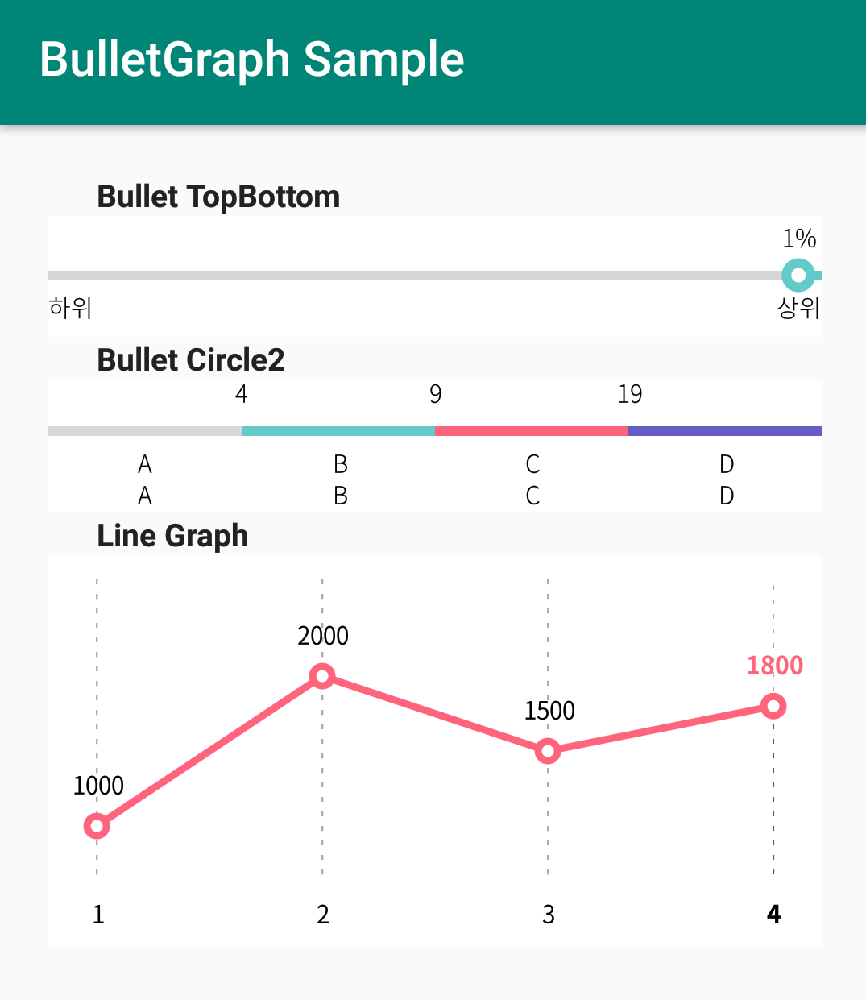

# BulletGraph

 
This repository contains `BulletGraph` that provides Bullet Graph Widget for android



## Features

- Block Graph, Circle Grpah, TobBottom Graph
- Calculation a x-coordinates to marker at range string array


## Setup

**Gradle**

- **Project level `build.gradle`**
```gradle
allprojects {
		repositories {
			...
			maven { url 'https://jitpack.io' }
		}
	}
```
- **App level `build.gradle`**
```gradle
	dependencies {
	        implementation 'com.github.jaloveeye:BulletGraph:1:0:4'
	}
```

### Usage

```xml
     <TextView
	android:text="@string/bullet_top_bottom"
	android:id="@+id/title_1"
	style="@style/SampleTextView"
	app:layout_constraintStart_toStartOf="parent"
	app:layout_constraintEnd_toEndOf="parent"
	app:layout_constraintTop_toTopOf="parent"
	/>
    <com.herace.bulletgraph.BulletTopBottom
	android:id="@+id/bullet_graph_1"
	android:layout_width="match_parent"
	android:layout_height="50dp"
	app:layout_constraintStart_toStartOf="parent"
	app:layout_constraintEnd_toEndOf="parent"
	app:layout_constraintTop_toBottomOf="@+id/title_1"
	app:bgColor="#FFFFFF"
	app:value="1"
	app:topbottom="true"
	app:bt_text_color="#595757"
	app:bt_graph_color="#62CBC9"
	/>
    <TextView
	android:text="@string/bullet_circle2"
	android:id="@+id/title_4"
	style="@style/SampleTextView"
	app:layout_constraintStart_toStartOf="parent"
	app:layout_constraintEnd_toEndOf="parent"
	app:layout_constraintTop_toBottomOf="@+id/bullet_graph_1"
	/>

    <com.herace.bulletgraph.BulletCircle2
	android:id="@+id/bullet_graph_4"
	android:layout_width="match_parent"
	android:layout_height="55dp"
	app:layout_constraintStart_toStartOf="parent"
	app:layout_constraintEnd_toEndOf="parent"
	app:layout_constraintTop_toBottomOf="@+id/title_4"
	app:bgColor="#FFFFFF"
	app:value="28"
	app:label_1_text="중등도|주의|고도|주의"
	app:label_2_text="4|9|19|27"
	app:label_3_text="비만|1단계|비만|3단계"
	app:graph_color="#D9D8D6|#62CBC9|#FF647D|#665CC7"
	app:text_color="#595757|#00A5B5|#FF647D|#665CC7"
	app:graph_range="0|5|10|20|28"
	/>
```


### Array
```xml
    <string-array name="graphA_LabelA">
        <item />
        <item>정상</item>
        <item>경도</item>
        <item>중등도</item>
        <item>중증</item>
        <item>말기</item>
    </string-array>
    
    <string-array name="graphA_LabelB">
        <item />
        <item>90</item>
        <item>60</item>
        <item>30</item>
        <item>15</item>
        <item />
    </string-array>
    
    <string-array name="graphA_Range">
        <item>200</item>
        <item>90</item>
        <item>60</item>
        <item>30</item>
        <item>15</item>
        <item>0</item>
    </string-array>

    <string-array name="graphB_LabelA">
        <item />
        <item>정상</item>
        <item>약양성 +-</item>
        <item>양성 1+</item>
        <item>양성 2+</item>
        <item>양성 3+</item>
        <item>양성 4+</item>
    </string-array>

    <string-array name="graphB_LabelB">
        <item />
        <item>15</item>
        <item>30</item>
        <item>100</item>
        <item>300</item>
        <item>1000</item>
        <item />
    </string-array>

    <string-array name="graphB_Range">
        <item>0</item>
        <item>15</item>
        <item>30</item>
        <item>100</item>
        <item>300</item>
        <item>1000</item>
        <item>2000</item>
    </string-array>

    <string-array name="graphC_LabelA">
        <item />
        <item>정상</item>
        <item>주의</item>
        <item>위험</item>
    </string-array>

    <string-array name="graphC_LabelB">
        <item />
        <item>120mmHg</item>
        <item>139mmHg</item>
        <item />
    </string-array>

    <string-array name="graphC_Range">
        <item>0</item>
        <item>120</item>
        <item>139</item>
        <item>300</item>
    </string-array>

    <string-array name="graphD_LabelB">
        <item />
        <item>80mmHg</item>
        <item>89mmHg</item>
        <item />
    </string-array>

    <string-array name="graphD_Range">
        <item>0</item>
        <item>80</item>
        <item>89</item>
        <item>200</item>
    </string-array>

```
